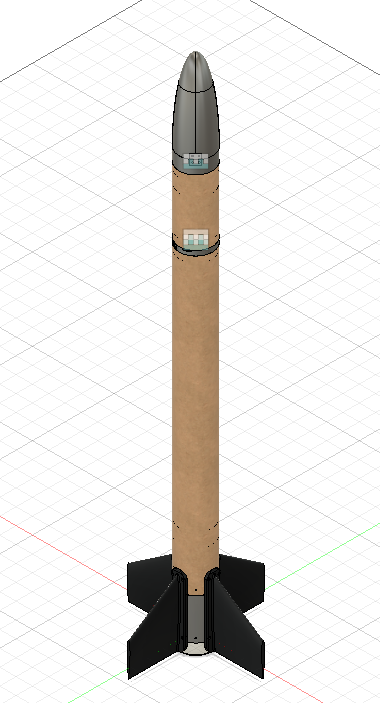
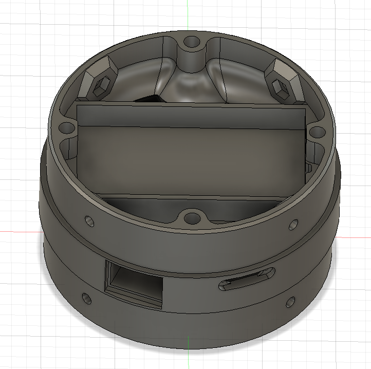
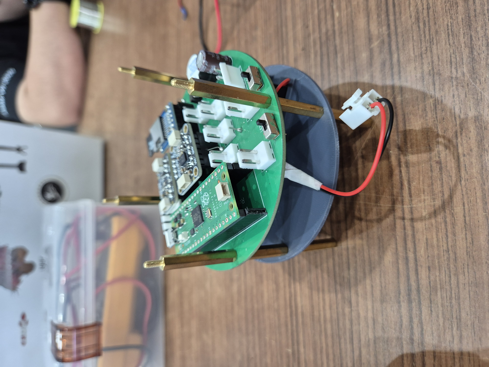
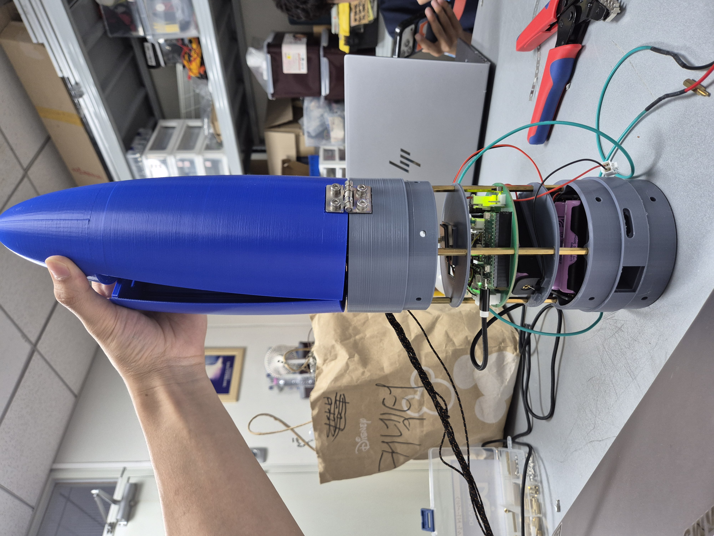
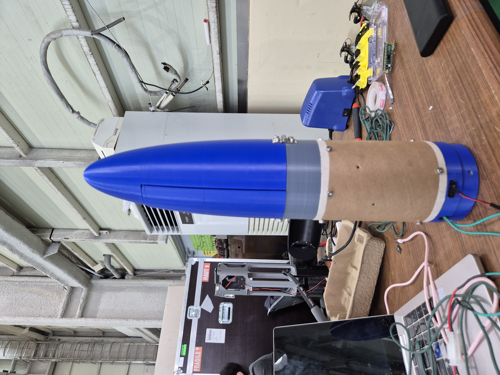
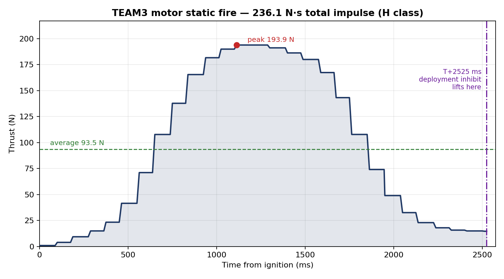
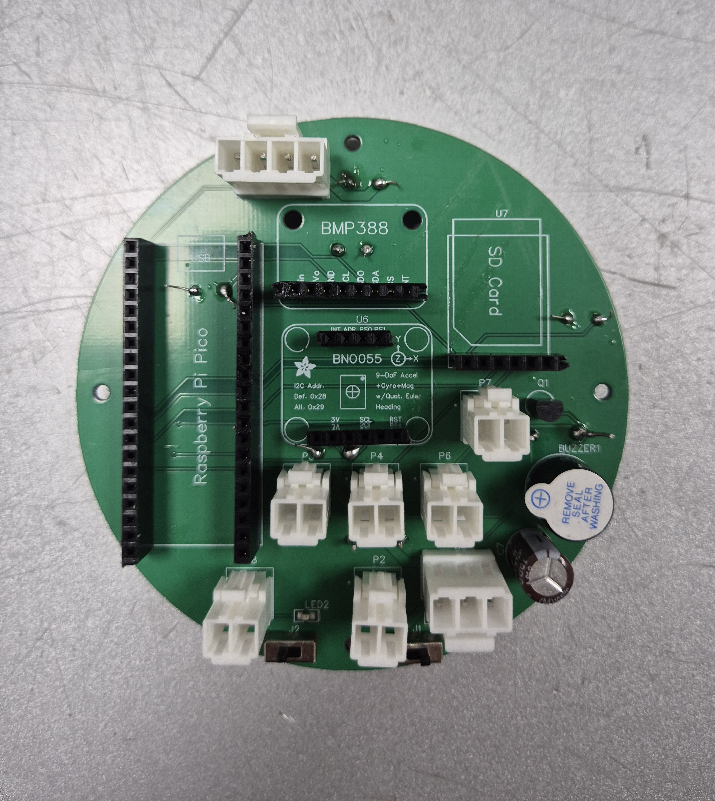
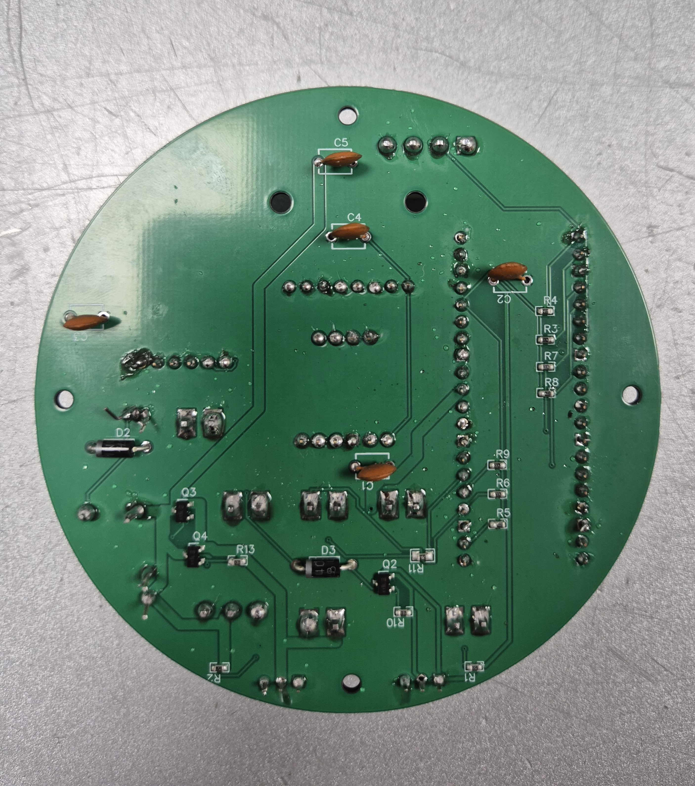
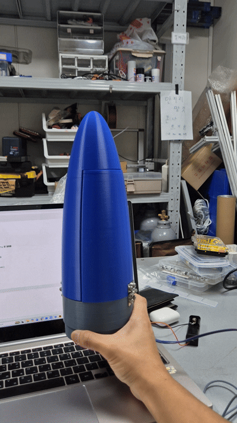

# TEAM3 Sounding rocket

**Flight computer for the TEAM3 sounding rocket** — Korea University rocketry
club, Team 3.


**Role — team lead (15 engineers) and control section lead.**

I owned the flight computer end to end: board design, firmware, threshold
derivation, ground-test tooling, and the post-flight anomaly investigation. I also
designed the avionics mount.

Outside the control section I prepared and extracted the propellant grains, and
assembled the outsourced casing with the grains, snap rings and O-rings. **Motor
design and performance specification were owned by the propulsion section, not by
me.** The design section owned the airframe; my contribution there was iterative
feedback on interfaces and revisions.

A single-stage model rocket avionics stack on a Raspberry Pi Pico. It detects
launch, decides when the vehicle reaches apogee, fires the parachute, logs the
full flight to SD, and beacons its position over GPS for recovery. No radio
telemetry — everything is decided onboard.

**The code in this repository is exactly what flew.** Nothing was cleaned up or
retrofitted after the fact.

---

## Flight result

Flown once. Honest summary:

| | |
|---|---|
| Launch | Success |
| Launch detection (3-pin umbilical release) | Nominal |
| **Parachute deployment** | **Success** |
| GPS satellite fix | **Never acquired on the pad** — see *Post-mortem* |
| Recovery | **Failed** — high winds carried the vehicle into a drainage ditch |
| Flight data | **None** — airframe and SD card were not recovered; only video |


https://github.com/user-attachments/assets/9bdc5b8e-13bc-4e4b-b4a7-bb61117ff043


*Launch and descent under canopy. With the airframe and SD card never recovered,
this footage is the only direct evidence of the flight.*

The deployment chain worked **despite** the GPS never getting a fix. That is the
one result worth taking away from this project: apogee detection was built from
three mutually independent detectors, so losing a subsystem did not compromise
the safety-critical function. Recovery, which depended on a single sensor, is
exactly what failed.

We have video of the descent under canopy but no telemetry, so every number in
this README comes from bench measurement and simulation rather than flight data.
Where that distinction matters, it is stated.

---

## What is actually interesting here

Model rocket flight computers are a well-trodden exercise. Four aspects of this
one are less common, and are documented in detail below:

1. **Verifying a one-shot system with no flight data.** There was exactly one
   launch and no opportunity to iterate. Deployment thresholds were set by
   measuring how large a *false* signal ground handling could produce, then
   placing each threshold in the gap between that and the smallest plausible
   *real* signal — with the cost of being conservative quantified before it was
   accepted, rather than assumed to be free.
   → [Setting the thresholds](#setting-the-thresholds-without-flight-data)

2. **Redundancy that degrades gracefully.** Apogee detection runs three
   detectors built on different physical principles, any one of which is
   sufficient on its own. They cross-check each other, and a detector that
   observes its own preconditions being violated — accelerometer saturation,
   integrator drift — disables itself rather than continuing to vote with
   corrupted data.
   → [Deployment triggers](#deployment-triggers)

3. **Prediction as a gate, never as a trigger.** The IMU detector computes a
   time-to-apogee estimate but will not fire on it. The estimate only decides
   when to begin testing for the measured event.
   → [Deployment triggers](#deployment-triggers)

4. **Interfaces designed around assembly and separation, not just contact.** The
   arming switches are unreachable once the airframe is closed, so an external
   rocker overrides them through a parallel MOSFET path. The launcher umbilicals
   use magnetic pogo pins, chosen for near-zero separation force rather than for
   contact quality.
   → [Power and arming](#power-and-arming) · [Umbilical interface](#umbilical-interface)

The vehicle was lost, so this repository is as much an anomaly report as a
firmware release. The failure — a GNSS receiver desensed by a co-located digital
subsystem, mitigated in firmware, and still insufficient at the launch site — is
written up in full rather than omitted.
   → [Post-mortem](#post-mortem--known-issues)

---

## The vehicle

Single-stage, solid-propellant, recovered by parachute. The flight computer rides
in a machined mount inside the airframe tube, which is why the board is circular
rather than rectangular.

<!--
설계도 2장 — Fusion 로그인 후 아래 두 줄의 주석을 풀고 파일을 업로드하세요.


*Full assembly. The design section owned the airframe; the avionics bay and mount were mine.*


*Avionics mount, my design. Locates the circular board concentrically in the tube.*
-->



*Flight computer going into the avionics mount.*



*Nose cone mated to the avionics assembly, with the parachute servo linkage and
the umbilical cables dressed out.*



*Nose cone, avionics and airframe tube assembled. At this point the onboard power
switches are sealed inside — see [Power and arming](#power-and-arming).*

### Motor

The motor was designed and specified by the propulsion section. I prepared and
extracted the propellant grains and assembled the casing, and ran the static
firing that produced the trace below.



*Static fire, load cell logged at 77 Hz.*

| | |
|---|---|
| Peak thrust | 193.9 N at T+1,113 ms |
| Average thrust | 93.5 N |
| Total impulse | 236.1 N·s — **H class** |
| Recorded burn | 0 – 2,525 ms |

Two numbers in the flight software come directly from this trace. The
**T+2,525 ms** deployment inhibit is the end of the recorded burn, and the
simulated apogee that sets the **T+9,000 ms** unconditional backstop is derived
from this impulse and the vehicle mass.

The reading had flattened near 14.7 N by the end of the trace rather than
decaying to zero, which is more consistent with a residual load-cell offset than
with real thrust. **The impulse figure should therefore be read as an upper
bound**, and the burn-time gate as the point where the motor is no longer
meaningfully accelerating the vehicle rather than where thrust reaches exactly
zero. The class assignment holds comfortably either way.
→ [Post-mortem 5](#5-load-cell-zero-offset-in-the-thrust-measurement)

---

## Hardware

| Component | Interface |
|---|---|
| **BMP388** barometer | I2C0 — SDA `GP0` / SCL `GP1` |
| **BNO055** IMU | I2C1 — SDA `GP2` / SCL `GP3` (AMG non-fusion mode, ±16 g) |
| **BE-220** GNSS | UART1 — TX `GP4` / RX `GP5`, 115200 baud |
| **MicroSD** | SPI1 — SCK `GP10` / MOSI `GP11` / MISO `GP12` / CS `GP13` |
| Umbilicals SAFE / POGO1 / POGO2 | `GP17` / `GP18` / `GP19` (pull-up; mated = LOW) |
| Buzzer (TMB12A05 + 2N3904) | `GP20` (active high) |
| Parachute servo | `GP26` (direct drive, non-inverting, 50 Hz PWM) |

| Front | Back |
|---|---|
|  |  |

*The assembled flight computer. The circular outline is sized to the airframe
tube; sensor breakouts and the SD module sit on the top layer, with the umbilical
and power connectors grouped on the lower edge where the harness exits.*

Schematic and layout:
[`hardware/schematic.pdf`](hardware/schematic.pdf) ·
[`hardware/pcb.pdf`](hardware/pcb.pdf)

**There is no ignition circuitry on this board.** The vehicle is single-stage and
the only actuator is the parachute servo, driven directly — no relay, no
optocoupler, no inversion to get wrong. That is a deliberately small safety
surface, and it is part of why this firmware can afford to be aggressive about
deploying on any one of three detectors: the worst thing an unexpected output can
do is open the parachute.

**Two independent power rails.** This split matters for fault diagnosis — several
confusing failures turned out to be one rail being off:

- **3.7 V** → Pico VSYS → internal 3.3 V → BMP388 · BNO055 · SD · pull-ups
- **5 V** → GNSS · servo · buzzer

### Power and arming

Each rail has an onboard switch — J2 for 3.7 V, J1 for 5 V. Both become
unreachable the moment the airframe is closed, which leaves an unpleasant choice:
either power the vehicle up before assembly and then handle a live board through
the whole build, or accept that it cannot be turned on once assembled.

The board takes neither. An external rocker (`OUT_SWITCH`, P7) pulls a shared
`REMOTE_ON` line to ground, driving the gates of P-channel MOSFETs that sit in
parallel with each onboard switch — Q2 on the 3.7 V rail, Q3 and Q4 paralleled on
5 V for lower on-resistance under servo load. 10 kΩ pull-ups hold both gates off
by default, and a 1N4148 in each gate path keeps the two rail networks from
back-feeding one another through the shared line.

Either path energises either rail independently. The vehicle is assembled cold
with the onboard switches off, carried to the pad inert, and brought up from
outside the airframe by one rocker throw.

### Umbilical interface

Three umbilicals — a safety pin plus two launcher-tie cables — on GP17, GP18 and
GP19, each pulled up to 3.3 V through 4.7 kΩ. The state machine will not accept a
launch until all three read released.

The two launcher-tie cables use **magnetic pogo-pin connectors**. The choice was
about separation force rather than contact quality. A connector that has to be
pulled apart at liftoff resists along the rail, and whatever it resists with comes
out of the vehicle's acceleration and can pull it off its intended path. A
magnetic pogo interface holds contact through spring pressure and releases at
essentially zero force, while keeping a wiping contact that does not degrade the
way a friction-fit header does after repeated mating.

This was informed by the opposite problem on a different vehicle. On
[ANAM-VII](https://github.com/rexkim1020/anam-vii-avionics), the second-stage
umbilicals broke out to 2.54 mm pin headers; one went open-circuit during pad
setup, the flight computer read it as launch, and the second stage ignited on the
rail. That board's fix was to move to screw terminals — reliable contact, but a
higher separation force and a manual step to get right. The pogo approach gets
the contact reliability without paying for it in separation force.

---

## Flight state machine

```
Stage 0  PAD        All 3 umbilicals mated. References (pressure, gravity
   ↕                vector, gyro bias) continuously re-zeroed.
                    Re-inserting the safety pin returns here.
Stage 1  ARMED      Safety pin (SAFE) pulled.
   ↓
Stage 2  FLIGHT     All 3 umbilicals released = launch detected. Latched;
   ↓                cannot revert. References frozen, attitude reset to 0°,
                    mission clock starts.
Stage 3  DEPLOYED   Servo releases → re-locks after 5 s → landing beacon.
```

**Safety interlock:** the board must observe the umbilicals *mated* at least once
after boot before it will accept a launch. Powering up with the umbilicals
already disconnected puts it in a permanent NO-LAUNCH state — no amount of
handling will deploy the parachute.

This came from a real near-miss on the bench: "all three umbilicals open" alone
is indistinguishable from "sitting on a table, never plugged in," and the early
firmware would happily fire the parachute four seconds after power-on.

---

## Deployment triggers

Three detectors run in parallel. **Any one** of them fires the parachute. All are
gated behind **T+2,525 ms**, the measured motor burn time — nothing can deploy
during thrust.

### 1. Barometric apogee — `logic_bmp.py`

```
fresh samples only (no duplicate processing)
  → median-of-5  → moving average of 10
  → 5 consecutive samples ≥ 1.5 m below peak altitude   → FIRE
```

The fresh-sample gate matters: the sensor ODR and the main loop are not
synchronised, so a naive read can process the same measurement twice. Duplicates
would let the "5 consecutive drops" confirmation be satisfied by fewer real
samples than intended, quietly loosening the criterion.

### 2. IMU vertical velocity — `logic_bno.py`

Fully independent of the barometer — different sensor, different physical
principle, different failure modes.

```
① ascent confirmed    peak velocity ≥ 10 m/s
② coast confirmed     deceleration ≤ −0.5 m/s² sustained for 800 ms
③ apogee gate         time-to-apogee  v/|a| ≤ 500 ms  →  open the descent test
④ descent confirmed   velocity ≤ −2.5 m/s sustained for 200 ms   → FIRE
```

**Step ③ is a gate, not a trigger.** The predicted apogee only decides *when to
start testing for descent*; the vehicle is never deployed on a prediction. The
final evidence is always a measured event — vertical velocity going and staying
negative.

This was a deliberate revision. An earlier design fired directly on `v/|a|`,
which fails because that expression assumes constant deceleration. Just after
burnout, velocity is at its maximum and so is drag, so `|a|` is at its
*largest* — the coast phase gets underestimated and the parachute opens while
still climbing. Simulation across light/medium/heavy vehicles put deployment at
+19.2 / +13.2 / +6.1 m/s of residual ascent velocity.

Recomputing the estimate every cycle fixes the bias on its own: as the vehicle
slows, drag falls away, `|a| → g`, and the constant-deceleration assumption
becomes true precisely when it is being relied on.

Acceleration is low-pass filtered at 10 Hz and integrated with the trapezoidal
rule. If the accelerometer is ever observed to saturate, the detector
invalidates itself rather than trusting a corrupted integral.

### 3. Altitude/time backup — `logic_backup.py`

```
(a) altitude exceeded 120 m at some point
    && T+4,000 ms elapsed
    && altitude now ≤ 120 m                              → FIRE
(b) T+9,000 ms unconditionally    (works even with no altitude data at all)
```

**The "has exceeded" latch is the whole point.** Without it, a flight whose
apogee lands near 120 m satisfies the condition *on the way up* — a vehicle
peaking at 119 m is passing 109 m at T+4 s while still climbing at 14 m/s. It
would blow the parachute under thrust-off ascent load, and worse, it would
pre-empt the two detectors that were about to get it right. Found in simulation
during design review, not in flight.

Backstop (b) exists for the opposite case: a motor underperforming badly enough
that 120 m is never reached. It is timed to the simulated apogee (7.15 s from
OpenRocket) plus margin. The asymmetry is deliberate — deploying early destroys
the parachute and the vehicle comes down ballistic, while deploying late only
means a harder canopy load.

### Cross-check between detectors

Barometric-derivative velocity and IMU-integrated velocity are compared
continuously. If they disagree by **more than 20 m/s for 1 second**, detector 2
disables itself — that pattern means the integral has drifted, and a drifted
integral deploys early. Detectors 1 and 3 stay live.

Bench-measured drift was far below this: 0.02 m/s over 18 seconds at rest.

### What it looks like



*Ground deployment test. The servo releases, the nose cone separates and the
canopy is drawn out; the servo re-locks 5 s later so it is not straining against
a travel limit for the rest of the descent.*

---

## Audio status codes

There is no radio link, so the buzzer is the only channel between the flight
computer and the pad crew. Every state has a distinct rhythm.

| Rhythm | Pattern | Meaning |
|---|---|---|
| 5 short pips, repeating | 130 ms × 5 | **Sensor fault — DO NOT LAUNCH** |
| One long tone, isolated | 800 ms on, 2200 ms off | Sensors OK, waiting on GPS fix |
| **Two long tones, paired** | 600·250·600, 2000 off | **All checks passed — cleared to launch** |
| Slow pips | 200 ms on / 400 ms off | Stage 0, on the pad |
| Triple chirp, then pause | 120·100·120 ×3, 1 s off | Stage 1 armed, ready |
| Fast continuous pips | 100 ms on / 150 ms off | Stage 1 armed, **no GPS fix** |
| Slow long tones | 600 ms on / 600 ms off | Stage 3, landing beacon |
| Single tick every 2.4 s | 60 ms | NO-LAUNCH — booted without umbilicals |

**Status codes are distinguished by rhythm, never by count.** An earlier version
encoded faults as "N beeps" — this is unusable in practice, because the pattern
repeats for a fixed window and there is no way to tell where one repetition ends
and the next begins. Field feedback during a rehearsal was simply "I heard three
long beeps," which the code had no way to mean.

The buzzer is driven from a **10 ms hardware timer**, not the main loop. The
main loop jitters between 25 and 45 ms depending on SD writes and GPS parsing,
which is enough to mangle a 120 ms chirp beyond recognition.

That decoupling has a safety consequence worth stating: because the buzzer keeps
playing even if the main loop dies, a hung flight computer *sounds perfectly
healthy*. This is the specific reason the watchdog was kept (see
[Design notes](#design-notes)).

---

## Setting the thresholds without flight data

We had one launch. There was no possibility of flying, examining the data, and
adjusting — the thresholds had to be right the first time.

The approach: rather than guessing what a real flight looks like, measure what a
*fake* flight looks like. `tools/falsetest.py` runs the exact flight-code
pipeline on the bench while the board is deliberately abused by hand — five
routines covering stationary, straight vertical translation, ascent with lateral
shake, vertical S-curves, and pure rotation. Each run reports the largest false
signal it produced at every stage of the detection chain.

Each threshold is then placed in the gap between the worst false signal below it
and the smallest plausible real signal above it:

| Threshold | Set to | Worst false signal (ground) | Margin above false | Margin below real flight |
|---|---|---|---|---|
| `IMU_MIN_SPEED` | 10 m/s | +2.83 m/s | 3.5× | 6.3× |
| `IMU_DECEL_HOLD_MS` | 800 ms | 452 ms | 1.8× | 7.1× |
| `IMU_NEG_SPEED_MPS` | −2.5 m/s | −1.78 m/s | 1.4× | 12× |
| `IMU_NEG_HOLD_MS` | 200 ms | 126 ms | 1.6× | 15× |

**The most useful thing we learned: false-trigger testing must be adversarial,
not representative.** The first round shook the board the way we imagined it
would be handled, and produced a worst-case false negative velocity of
−0.52 m/s. A later round, run with the explicit goal of *breaking* the detector,
produced −1.78 m/s — 3.4× larger, and past the threshold that had been set from
the gentle data. The gentle numbers would have shipped a detector that could
false-trigger in flight.

That round also exposed a genuine defect rather than just a loose number: the
false descent signal persisted for 126 ms against a 150 ms hold requirement — a
margin of a single loop iteration. The run did not deploy, but only because an
earlier stage happened to block it; in a real flight that earlier stage
necessarily passes, leaving the 24 ms margin as the sole line of defence. All
four thresholds were raised in response.

The cost of being conservative was quantified before accepting it: simulation
puts deployment at apogee **+0.56 to +0.60 s** across barometric noise and ±15%
thrust variation, versus +0.38 s with looser values. That is 1.8 m of altitude
and a 3× higher canopy load — acceptable, given that the failure mode on the
other side is a destroyed parachute and a ballistic descent.

---

## Repository layout

```
main.py            Flight loop: state machine, sensor polling, deployment
                   decision, logging
config.py          Every tunable in one place — pinmap through thresholds

bmp388.py          Barometer driver (Bosch float compensation, ERR/PWR
                   register validation)
bno055.py          IMU driver (AMG non-fusion mode, ±16 g via page-1 registers)
gps.py             NMEA parser (GGA/RMC), non-blocking
sdcard.py          SD SPI block device
sdlog.py           CSV logger (23 columns, append mode, periodic commit)

attitude.py        Quaternion attitude integration, tilt angle, frame rotation
velocity.py        Least-squares differentiation of barometric altitude
                   (independent velocity estimate for cross-checking)

logic_bmp.py       Detector 1 — barometric apogee
logic_bno.py       Detector 2 — IMU vertical velocity
logic_backup.py    Detector 3 — altitude/time backup

stage_io.py        3-pin umbilical debounce → stage decision
buzzer.py          Timer-driven pattern playback (allocation-free callback)
servo_release.py   Parachute servo with automatic re-lock

hardware/          Schematic and PCB layout (PDF, EasyEDA)
docs/images/       Board and vehicle photography, thrust curve
tools/             Ground test utilities (not required on the flight board)
```

`bno055.py` will load `imu_cal.py` and apply a six-face static calibration if
that file is present, falling back to uncalibrated operation otherwise. **It was
deliberately absent for this flight** — see [Design notes](#design-notes).

---

## Installation

```bash
# Flash MicroPython first (RPI_PICO ... .uf2), then:
py -m mpremote connect COM<n> fs cp *.py :
```

MicroPython does not resolve modules in subdirectories. Files from `tools/` must
be copied to the board root when used:

```bash
py -m mpremote connect COM<n> fs cp tools/bench.py :
```

**The SD card must be FAT32** — MicroPython cannot read exFAT.

Logs are **appended** to `/sd/flight.csv`, so the card does not need reformatting
between runs. Each power-up writes a `==== BOOT ====` separator to delimit
sessions.

---

## Ground test tools (`tools/`)

| File | Purpose |
|---|---|
| `bench.py` | Per-subsystem checkout. **`bench.axis()`** determines IMU axis and sign automatically and prints the `config.py` lines to paste. |
| `falsetest.py` | Adversarial false-trigger testing through the real flight pipeline — how the thresholds above were set. |
| `groundtest.py` | Audio and state-transition rehearsal (`sounds()` / `run()`). |
| `servocal.py` | Finds lock/release servo angles. Ramps 25 µs at a time from neutral; never jumps. |
| `gpssky.py` | GNSS reception quality — per-satellite SNR. |
| `imu_calibrate_6face.py` | Six-face static accelerometer calibration (optional, unused in flight). |
| `flightstate.py` | Persistent state for reboot recovery (optional, unused in flight). |

---

## Post-mortem / known issues

### 1. GNSS desense from the co-located SD interface ★ — root cause of the loss

**With the SD card active, the GNSS module could not acquire a fix. With the
card removed, it acquired reliably.** The relationship was clean and repeatable.

This is receiver desense: broadband noise from the SD SPI interface raising the
noise floor at GPS L1 (1575 MHz), where the signal of interest arrives at around
−130 dBm.

The mitigation was to make the board quiet while it matters most — on the pad,
logging drops to 1 Hz and commits stretch to 10 s (`SD_PAD_LOG_MS`,
`SD_PAD_FLUSH_MS`), roughly a 23× reduction in SPI activity, reverting to full
rate the instant launch is detected. The reasoning was that acquisition is far
harder than tracking, so a fix obtained in the quiet period should survive the
noisy one.

**It was not enough. No fix was ever acquired at the launch site**, and without
coordinates the vehicle could not be located after it landed off-target.

This is a layout problem being papered over in firmware. The correct fix is
physical: move the GNSS antenna away from the SD module and its traces, and
shield it. Any future revision of this board should treat antenna placement as a
routing constraint, not an afterthought.

### 2. 64 GB SDXC incompatibility

The standard MicroPython SPI driver fails to initialise 64 GB cards —
`timeout waiting for v2 card`. CMD0 and CMD8 respond normally, so the wiring is
sound; `ACMD41` simply never completes. The same card is healthy in a PC reader.

**Use cards ≤ 32 GB.** The flight card was 8 GB, which initialised without
issue. A full flight log is about 2 MB, so capacity was never a constraint —
the 64 GB card was simply the one on hand at the time.

### 3. Servo holding current

With the parachute loaded, the servo works continuously against spring tension.
It shares the 5 V rail with the GNSS module and buzzer, so that current draw is
not isolated from the subsystem that most needs a clean supply.

This cannot be solved in firmware — a standard servo offers no way to reduce
holding torque while commanded to a position. The real fix is mechanical: a
self-locking latch, so the servo sets the mechanism rather than holding the load.

Firmware does what it can at the other end: `SERVO_RELOCK_MS` returns the servo
to the lock angle 5 s after deployment, so it is not straining against a travel
limit for the entire descent and post-landing beacon period.

### 4. Recovery had no redundancy

The proximate cause of the loss was wind. The underlying cause is that recovery
depended entirely on GPS, and GPS had failed — leaving no fallback at all. The
deployment path was triple-redundant; the recovery path was not redundant at
all, and that is where the mission was lost.

Future builds should carry recovery aids that do not depend on any electronics:
high-visibility finish, streamers, and a louder landing beacon.

### 5. Load-cell zero offset in the thrust measurement

The static-fire trace does not return to zero — it flattens near 14.7 N, 7.6% of
peak, and recording was stopped there on the judgement that the remainder was
negligible. A solid motor tails off toward zero rather than asymptoting to a
constant, so this is most likely a zero offset that appeared during the burn,
from thermal drift or the mount settling under load.

It matters because every derived figure inherits it. Integrated across 2.525 s an
offset of that size accounts for roughly 35 N·s, so the 236.1 N·s total is an
upper bound. The next static fire should re-zero after the burn and subtract the
offset, and should record until the reading is genuinely flat at zero rather than
until it looks small.

---

## Design notes

- **The IMU does not run in fusion mode.** BNO055 fusion output forces a ±4 g
  accelerometer range; this vehicle pulls roughly 6 g during burn with peaks
  above 10 g, so fusion output saturates exactly when it is needed. Worse, the
  fusion filter interprets sustained thrust as gravity and corrupts the attitude
  estimate along with it. The driver runs AMG (non-fusion) at ±16 g and attitude
  is integrated from raw gyro instead.

- **Attitude is integrated as a quaternion,** not as independent per-axis angles.
  Rockets roll, and roll couples the pitch and yaw rates in a way naive
  integration cannot represent. At 200 dps spin with 4 dps pitch, the correct
  answer is 2.24° while naive two-axis integration reports 40.08° — an 18×
  error. Validated against an independent 2 kHz DCM implementation: maximum
  divergence 0.18°.

- **Vertical acceleration is projected onto the measured gravity vector,** not
  read off a body axis. The three-axis gravity vector is averaged on the pad;
  in flight the body-frame acceleration is rotated by the current attitude and
  projected onto it. Using a single axis leaves X/Y accelerometer bias
  uncorrected and ignores pad tilt — the measured pad gravity vector on this
  board was (−0.042, −0.541, +9.733), so the Y component alone was 0.54 m/s².

- **Watchdog kept, reboot recovery removed.** These are normally a pair, and
  splitting them was a deliberate call specific to this mission profile. Reboot
  recovery was the least exercised path in the system and had already caused an
  anomaly — a servo jumping to the deployed position on power-up, from stale
  persisted state. Against that, the exposure it covered was a brownout during a
  **ten-second** powered flight, on a vehicle with a solid battery connector and
  bulk capacitance. Removing the untested path reduced risk more than keeping it
  did. **The same reasoning inverts for any long-duration or unattended system,
  where the recovery path has to exist and therefore has to be tested.**

  The watchdog was kept for an unrelated reason: it is the only thing that
  catches a pre-launch hang. Because the buzzer plays from its own timer, a dead
  main loop still *sounds* healthy, so a hang is otherwise invisible to the pad
  crew. `wdt.feed()` is called outside the loop's try block, so a caught
  exception is not misread as a hang.

- **Six-face IMU calibration was implemented and then deliberately not used.**
  In free fall the accelerometer bias is already absorbed by the pad reference:
  `a_net = bias·û − g₀` cancels it algebraically. The residual benefit appears
  only under significant attitude deviation, and works out to roughly 0.05 s of
  apogee-detection accuracy — while a *badly performed* calibration silently
  contaminates every downstream estimate and is worse than none. The tooling is
  in the repository; the calibration file is not.
